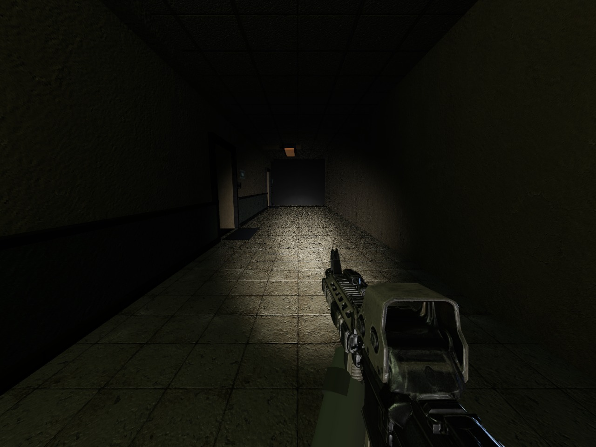
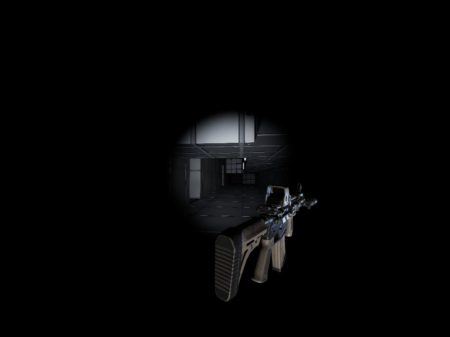

<p align="center">
  <b>Unholy</b> — a game built on a browser engine written from scratch.
</p>

---

**Unholy** is an asymmetric horror shooter: four soldiers enter a condemned
apartment block at night, four demons are already inside. The soldiers own the
firing lines; the demons own the walls, the ceilings and the ducts. There is no
power in the building, so the soldiers see what their weapon lights see, and
every death is final — no respawn, four against four down to one against one.

---

## Where this stands

The building exists and it is dark. You can walk it: four floors, a corridor
the length of the block, two apartments a floor, a stairwell, and a vent
network that the soldiers cannot enter. Your rifle light is the only light you
carry, and helicopter searchlights sweep the façades outside. That is the whole
of it for now — the demons, the two teams and the match rules come next.



*The whole corridor is that beam. The ducting overhead is the demons' road.*



*Nothing else lights the weapon. Switch the light off and it goes with the
room.*

Underneath is the engine it is built on, brought over whole from the rendering
work that preceded it: it loads a level, lights it, runs a player and seven
opponents in it at 125 Hz, and draws the result with a modern pipeline.

What it can do, briefly:

- **The building.** Built entirely by code, block by block: each block lays its
  geometry and its collision volume at the same time, so what you see is what
  stops you, and there is no map editor or compiler in the loop. The vent
  network is the one asymmetry in the plan — its mouths carry a volume that
  stops a soldier and lets a demon through, which is the engine's own clip
  mechanism, and the test walks every duct to prove it.
- **The dark.** No sun, no ceiling lights, an ambient just above black. A
  shadow-casting spotlight rides the weapon; two more sweep the outside and come
  in through the windows. The beam's power was measured rather than guessed: a
  partition at one metre reads around 130 of 255, a ceiling at two metres 80.
  The rifle is lit by that beam and by nothing else: switch the light off and
  the weapon in your hands goes dark with the room, twenty-eight times dimmer.
- **The rifle.** The soldier's only weapon, an exported model rather than a
  game asset, brought into the hand by measuring it: the longest side is the
  barrel, the thinnest end is the front, and the hold was set by projecting the
  silhouette on screen until it sat in the lower quarter at a quarter of the
  width.
- **Levels from Quake III.** BSP v46 geometry, lightmaps, the light grid, curved patches,
  visibility, movers, triggers, and the `.shader` scripts that say how each
  surface is drawn. Archives are read over HTTP range requests, so a level is
  mounted without downloading everything.
- **Rendering.** Deferred-ish chain over Three.js: dynamic lights and shadows
  on top of the baked lighting, reflection probes, ambient occlusion, bloom,
  colour grading per level, dynamic internal resolution, and nine debug
  channels to look at any single term.
- **Materials.** An offline Python chain rebuilds textures in high definition
  from the originals — learned upscaling where it holds up, normal, roughness,
  metal and occlusion maps derived from the colour, validation against the
  source, and optional GPU compression.
- **Play.** Original 125 Hz movement, the nine weapons with their own damage,
  splash and knockback, items and respawn timers, a Free For All match against
  bots that navigate the level with its own navigation data, player models with
  their animations and held weapons, gibs, obituaries, a scoreboard.
- **Tools.** A real benchmark on a camera path built from the level itself, a
  material comparison mode, in-page screenshots written to `docs/`, and a
  settings panel with sixty knobs for putting the image right.

**Game data is never in this repository.** The levels, textures, models and
sounds are read at runtime from a Quake III Arena installation on your own
machine, linked into `public/data`; the high definition materials derived from
them are written to a folder that git ignores. Clone this and you get code.

---

## Requirements

- Node 20 or newer, a browser with WebGL 2.
- A Quake III Arena installation, for as long as the game uses its data.
- Python 3.11 with numpy and Pillow, for the texture chain only.

---

## Getting started

```bash
npm install
```

Link your game data, then start the dev server:

```bash
ln -s "/path/to/Quake III Arena/baseq3" public/data/baseq3
```

```bash
npm run dev
```

The menu opens on the building itself — the backdrop is the game, not an image —
and entering it loads nothing. The server listens on port 5214. **F** switches
the rifle light off, which is a tactical choice rather than a setting. URL
parameters: `?play` enters the building
immediately, `?mute` silences the sound, `?map=<name>` loads a Quake III map
instead, and `?source=<folder>` chooses which data folder to mount.

The Quake III archives are mounted in the background, after the menu is up, and
nothing in the game waits for them: they serve the engine tools, and the
opponents' bodies until they have their own. **Engine tools** in the menu is
where the benchmark, that map and the test arena live.

---

## Layout

```
src/
  audio/        sound playback, decoding, master volume
  formats/      pk3, bsp, md3, aas, shader scripts, binary reading
  bsp/          geometry, lightmaps, light grid, visibility, curved patches
  game/         session, player movement, collision, weapons, entities
                match/      fighters, damage, match rules, player models
                bots/       navigation over the level's areas, behaviour
                unholy/     the building: plan, vents, searchlights
                build/      lays a level block by block, geometry and collision
                light/      the rifle light
                benchmark/  camera path and measurement
  renderer/     pipeline, settings, lighting, materials, grading, post
  ui/           menu, HUD, settings, benchmark screens
tools/
  texture-pipeline/     the offline chain, Python, numpy and Pillow only
  materials.test.ts     material and shader script tests
  movement.test.ts      step climbing test
  weapons.test.ts       weapon frames and rail behaviour
  building.test.ts      the building: corridors, doors, stairs, vents
  render-smoke.html     rendering smoke test
  profile.html          per-pass profiling
public/
  data/         your archives, or links to them, never in git
  generated/    materials produced by the chain, never in git
docs/           screenshots written by the capture tools
```

---

## Tests and checks

```bash
npm run check   # TypeScript, no emit
npm test        # materials, shaders, light grid, lava, movement, weapons, the building
npm run build   # type check then production build
```

```bash
python3 tools/texture-pipeline/test_pipeline.py
```

Each test exists because something was broken and stayed broken for a while.
The movement one walks a flight of sixteen unit steps: the slide move used to
report "not blocked" as soon as one of its bumps ended in the clear, so step
climbing was never attempted and the player stood in front of every staircase.

The building one walks the building. Four of its assertions exist because the
plan was wrong in ways nothing showed on screen: vent mouths pasted onto solid
walls, every slab laid twice as a floor and as a ceiling, a stairwell door cut
into a wall that was then laid solid over it, and a landing that stopped fifty
units short of the wall, through which you fell down the shaft. It builds the
level without rendering — the materials are painted into a canvas, which only a
browser has — and asks the geometry whether you get through.

---

## Credits

**Quake III Arena** is the work of id Software, 1999. Its data is read from
your own installation and never leaves your machine. Everything here — engine,
renderer, material chain, game code — is written from scratch.
